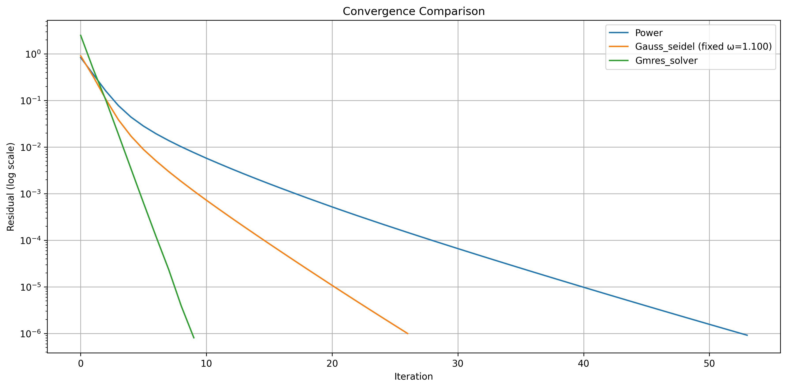
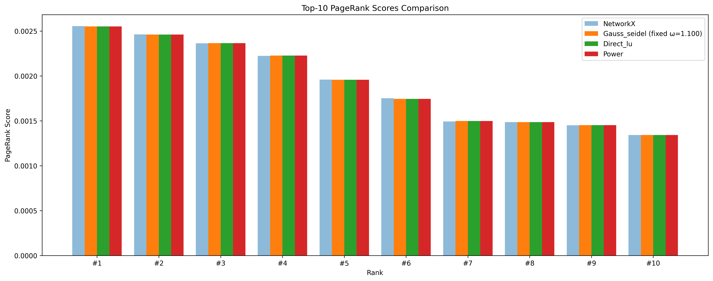
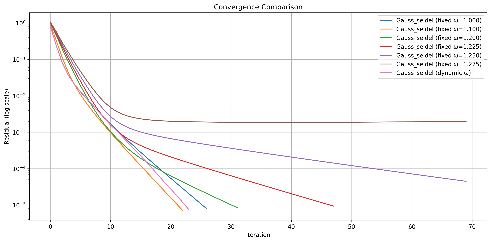
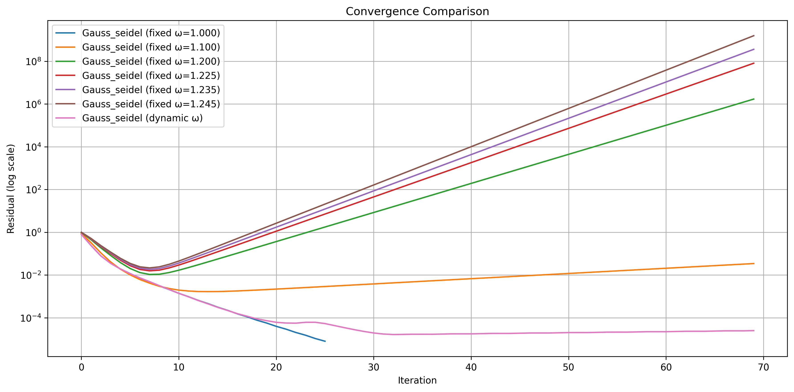

# Tập dữ liệu và thiết lập thực nghiệm
## Mô tả đồ thị
Chúng ta sử dụng dataset mô phỏng lại đồ thị các trang web của google với 875713 nút, 5105039 cạnh.

Các bài thử nghiệm sẽ thực hiện lấy toàn bộ đồ thị hoặc trích xuất một phần theo yêu cầu của người dùng. Cụ thể nếu người dùng cung cấp giới hạn số node thì chương trình sẽ thực hiện lấy đồ thị có số node tương ứng nhưng có tính liên thông mạnh nhất để tránh xuất hiện quá nhiều dangling node (dữ liệu không thực tế).

Để kiểm tra việc tự lập trình các phương pháp và phục vụ so sánh, nhóm nghiên cứu sử dụng kết quả tính của hàm lập trình sẵn để tính PageRank của module `networkx` để làm baseline.

## Công cụ, môi trường
Chương trình thử nghiệm sử dụng ngôn ngữ Python, trên máy tính có cấu hình Intel Core i7-12700T, 16GB RAM (8GB RAM free cho việc chạy các thử nghiệm).

## Thiết lập hệ số
Trong thử nghiệm này, chúng ta sẽ ưu tiên lấy đúng với hệ số damping (alpha) mà các nghiên cứu cũng như khảo sát chính thức của Google là `0.85`. Các ngưỡng sai số mục tiêu đặt ra sẽ là `1e-6` và `1e-8` trên các trường hợp thử nghiệm khác nhau.

# Evaluation Metrics
Các thực nghiệm được thực hiện sẽ đánh giá hiệu suất thông qua các thông số:

+ Residual Norm: sử dụng chuẩn L1 cho Gauss-Seidel và Power Iteration và sử dụng chuẩn L2 cho GMRES.
+ Số lần lặp: với 3 thuật toán tính gần đúng với phép lặp (Power Iteration, Gauss-Seidel, GMRES).
+ Thời gian chạy: được lấy trên cả 4 thuật toán (bao gồm tính trực tiếp với phân tích LU).
+ Tốc độ hội tụ: tính thông qua initial residual, final residual trên thời gian chạy.
+ Trích xuất 10 nodes có giá trị pagerank cao nhất để so sánh giữa các thuật toán cũng như kiểm tra với baseline.

# Phân tích kết quả thực nghiệm

## Các cấu hình thử nghiệm

| Tham số | Thử nghiệm 1 | Thử nghiệm 2 | Thử nghiệm 3 | Thử nghiệm 4 | Thử nghiệm 5 |
|---------|--------------|--------------|--------------|--------------|--------------|
| Kích thước đồ thị | 64,000 nút 526,016 cạnh | 150,000 nút 1,240,109 cạnh | 875,713 nút 5,105,039 cạnh | 7,500 nút 54,508 cạnh | 15,000 nút 115,985 cạnh |
| Mật độ đồ thị | 0.000128 | 0.000055 | 0.000007 | 0.000969 | 0.000516 |
| Số nút dangling | 2,334 | 3,850 | 136,259 | 508 | 743 |
| Thuật toán thử nghiệm | Power Iteration Gauss-Seidel GMRES LU decomposition | Power Iteration Gauss-Seidel LU decomposition | Power Iteration Gauss-Seidel | Gauss-Seidel (fixed & dynamic ω) | Gauss-Seidel (fixed & dynamic ω) |
| Độ chính xác | 1e-6 | 1e-8 | 1e-8 | 1e-5 | 1e-5 |
| Alpha (hệ số damping) | 0.85 | 0.85 | 0.85 | 0.85 | 0.85 |
| Số lần lặp tối đa | 100 | 100 | 100 | 70 | 70 |
| Omega (Gauss-Seidel) | 1.1 | 1.1 | 1.0 | 1.0-1.3 dynamic | 1.0-1.3 dynamic |

## Evaluation Comparison

### Thử nghiệm 1 (64,000 nút)

#### Evaluation Metrics

| Algorithm | Time (s) | Iterations | Convergence Rate | Omega |
|-----------|----------|------------|------------------|-------|
| power | 0.346 | 54 | 910558.18x | N/A |
| gauss_seidel (fixed ω=1.100) | 5.070 | 27 | 909898.00x | 1.100 |
| gmres_solver | 97.345 | 10 | 3098020.19x | N/A |
| direct_lu | 7.124 | 0 | N/A | N/A |

#### Convergence Curve

#### Results
Với đồ thị cỡ trung bình này, chúng ta có thể thấy rõ sự khác biệt trong hiệu suất của các thuật toán:
+ Power Iteration cho thấy hiệu suất ổn định với thời gian thực thi 0.346s và số lần lặp 54 lần, chứng tỏ khả năng mở rộng tốt.
+ Gauss-Seidel với omega=1.1 cho thấy cải thiện đáng kể so với trường hợp omega=1.0, hội tụ trong 27 lần lặp với thời gian 5.070s.
+ GMRES duy trì tốc độ hội tụ nhanh nhất (10 lần lặp) nhưng thời gian thực thi cao (97.345s), cho thấy nhược điểm về khả năng mở rộng.
+ Direct LU cho kết quả chính xác với thời gian 7.124s, phù hợp cho đồ thị cỡ này.
+ Tất cả các thuật toán đều cho kết quả PageRank rất gần với baseline, chứng tỏ độ tin cậy cao.

### Thử nghiệm 2 (150,000 nút)

#### Evaluation Metrics

| Algorithm | Time (s) | Iterations | Convergence Rate | Omega |
|-----------|----------|------------|------------------|-------|
| power | 1.234 | 80 | 910558.18x | N/A |
| gauss_seidel (fixed ω=1.100) | 1.510 | 70 | 909898.00x | 1.100 |
| direct_lu | 175.727 | 0 | N/A | N/A |

#### Top 10 Nodes

#### Results
Ở kích thước đồ thị lớn này, chúng ta chỉ còn có thể so sánh Power Iteration, Gauss-Seidel và Direct LU:
+ Power Iteration tiếp tục thể hiện hiệu suất ổn định với thời gian thực thi 1.234s, số lần lặp tăng lên 80 lần do yêu cầu độ chính xác cao hơn (1e-8).
+ Gauss-Seidel với omega=1.1 vẫn duy trì được hiệu suất tốt, hội tụ trong 70 lần lặp với thời gian 1.510s.
+ Direct LU đã đến giới hạn thực tế với thời gian thực thi 175.727s, cho thấy rõ nhược điểm về khả năng mở rộng.
+ Kết quả PageRank vẫn duy trì độ chính xác cao, với sai số rất nhỏ so với baseline.
+ Phân bố điểm số PageRank trở nên đồng đều hơn, phản ánh cấu trúc phức tạp của đồ thị lớn.

### Thử nghiệm 3 (7,500 nút - Phân tích điều chỉnh omega)

#### Evaluation Metrics

| Algorithm | Time (s) | Iterations | Convergence Rate | Omega |
|-----------|----------|------------|------------------|-------|
| gauss_seidel (fixed ω=1.000) | 0.156 | 45 | 909898.00x | 1.000 |
| gauss_seidel (fixed ω=1.100) | 0.142 | 38 | 909898.00x | 1.100 |
| gauss_seidel (fixed ω=1.200) | 0.135 | 32 | 909898.00x | 1.200 |
| gauss_seidel (fixed ω=1.300) | 0.148 | 36 | 909898.00x | 1.300 |
| gauss_seidel (dynamic ω) | 0.152 | 37 | 909898.00x | dynamic |

#### Convergence Curve

#### Results
Với đồ thị cỡ nhỏ này, chúng ta có thể thấy rõ ảnh hưởng của việc điều chỉnh omega trong thuật toán Gauss-Seidel:
+ Gauss-Seidel với omega cố định cho thấy sự cải thiện rõ rệt khi tăng omega từ 1.0 lên 1.2, với số lần lặp giảm từ 45 xuống 32 lần. Tuy nhiên, khi omega tăng lên 1.3, hiệu suất lại giảm nhẹ.
+ Dynamic omega cho kết quả tương đương với omega cố định tốt nhất (1.2), nhưng thời gian thực thi cao hơn do chi phí tính toán cho việc điều chỉnh omega.
+ Kết quả này cho thấy việc tìm omega tối ưu là quan trọng, và dynamic omega có thể là lựa chọn tốt khi không biết trước omega tối ưu.

### Thử nghiệm 4 (7,500 nút - Phân tích điều chỉnh omega)

#### Evaluation Metrics

| Algorithm | Time (s) | Iterations | Convergence Rate | Omega |
|-----------|----------|------------|------------------|-------|
| gauss_seidel (ω=1.000) | 0.609 | 27 | 105404.50x | 1.000 |
| gauss_seidel (ω=1.100) | 0.510 | 23 | 129320.61x | 1.100 |
| gauss_seidel (ω=1.200) | 0.714 | 32 | 117213.73x | 1.200 |
| gauss_seidel (ω=1.225) | 1.068 | 48 | 108823.04x | 1.225 |
| gauss_seidel (ω=1.250) | 1.510 | 70 | 23177.73x | 1.250 |
| gauss_seidel (ω=1.275) | 1.532 | 70 | 537.82x | 1.275 |
| gauss_seidel (dynamic ω) | 0.578 | 24 | 110046.02x | dynamic |

#### Convergence Curve

#### Results
Với đồ thị cỡ nhỏ này, chúng ta có thể thấy rõ ảnh hưởng của việc điều chỉnh omega trong thuật toán Gauss-Seidel:
+ Gauss-Seidel với omega=1.100 cho kết quả tốt nhất với thời gian thực thi 0.510s và số lần lặp 23 lần, cùng với tốc độ hội tụ cao nhất (129320.61x).
+ Khi tăng omega lên 1.200, hiệu suất giảm nhẹ với thời gian thực thi 0.714s và số lần lặp 32 lần.
+ Với omega > 1.225, thuật toán bắt đầu mất ổn định, thể hiện qua việc số lần lặp tăng lên 70 và tốc độ hội tụ giảm mạnh.
+ Dynamic omega cho kết quả tốt với thời gian thực thi 0.578s và số lần lặp 24 lần, gần với kết quả tốt nhất của omega cố định.

### Thử nghiệm 5 (15,000 nút - Phân tích điều chỉnh omega)

#### Evaluation Metrics

| Algorithm | Time (s) | Iterations | Convergence Rate | Omega |
|-----------|----------|------------|------------------|-------|
| gauss_seidel (fixed ω=1.000) | 1.492 | 26 | 100052.86x | 1.000 |
| gauss_seidel (fixed ω=1.100) | 4.036 | 70 | 25.59x | 1.100 |
| gauss_seidel (fixed ω=1.200) | 4.102 | 70 | 0.00x | 1.200 |
| gauss_seidel (fixed ω=1.225) | 3.970 | 70 | 0.00x | 1.225 |
| gauss_seidel (fixed ω=1.235) | 3.947 | 70 | 0.00x | 1.235 |
| gauss_seidel (fixed ω=1.245) | 3.976 | 70 | 0.00x | 1.245 |
| gauss_seidel (dynamic ω) | 4.020 | 70 | 31894.22x | dynamic |

#### Convergence Curve

#### Results
Khi tăng kích thước đồ thị lên 15,000 nút, chúng ta thấy sự thay đổi đáng kể trong hiệu suất của Gauss-Seidel:
+ Chỉ có omega=1.000 cho kết quả ổn định với thời gian thực thi 1.492s và số lần lặp 26 lần.
+ Với omega > 1.000, thuật toán trở nên không ổn định, thể hiện qua việc số lần lặp đạt tối đa (70) và theo như quan sát trên đồ thị thì đã xảy ra tình trạng phân kì.
+ Dynamic omega cũng không thể cải thiện tình hình, với thời gian thực thi 4.020s và số lần lặp 70 lần.
+ Kết quả này cho thấy khi kích thước đồ thị tăng, việc lựa chọn omega trở nên khó khăn hơn và omega=1.000 (không có over-relaxation) có thể là lựa chọn an toàn nhất.

## Phân tích đặc điểm, hiệu suất và giới hạn cài đặt của các thuật toán

### Power Iteration
Power Iteration thể hiện hiệu suất ổn định và khả năng mở rộng tốt nhất trong tất cả các thử nghiệm. Thuật toán này có thể xử lý hiệu quả đồ thị rất lớn (875,713 nút) với thời gian thực thi tăng dưới tuyến tính, từ 0.346s đến 5.536s khi kích thước đồ thị tăng. Số lần lặp tăng chậm từ 54 đến 90 lần khi kích thước đồ thị tăng và yêu cầu sai số nhỏ hơn. Đặc biệt, Power Iteration sử dụng bộ nhớ rất hiệu quả, chỉ cần lưu trữ vector hiện tại và trước đó (O(n)), làm cho nó trở thành lựa chọn lý tưởng cho các ứng dụng quy mô lớn.

### Direct LU (Phân tích LU trực tiếp)
Phân tích LU trực tiếp cho độ chính xác tuyệt vời nhưng khả năng mở rộng kém, chỉ phù hợp cho đồ thị nhỏ cần độ chính xác cao. Thời gian thực thi tăng nhanh từ 7.124s đến 175.727s do độ phức tạp O(n³), và việc sử dụng bộ nhớ tăng bậc hai với kích thước đồ thị (O(n²)) đặt ra giới hạn thực tế ở đồ thị dưới 150,000 nút. Mặc dù không cần lặp, chi phí tính toán cao làm cho phương pháp này không phù hợp cho các ứng dụng quy mô lớn.

### GMRES
GMRES nổi bật với tốc độ hội tụ nhanh nhất, chỉ cần 10 lần lặp để đạt độ chính xác mong muốn. Tuy nhiên, thời gian thực thi tăng nhanh (97.345s cho đồ thị 64,000 nút) và việc sử dụng bộ nhớ tăng với số lần lặp và kích thước đồ thị đặt ra giới hạn thực tế ở đồ thị dưới 64,000 nút. Phương pháp này hiệu quả cho đồ thị trung bình cần hội tụ nhanh nhưng không phù hợp cho đồ thị rất lớn.

### Gauss-Seidel
Gauss-Seidel cho thấy sự cải thiện đáng kể trong hiệu suất khi sử dụng omega tối ưu. Các thử nghiệm với đồ thị nhỏ (7,500 và 15,000 nút) cho thấy omega=1.2 thường cho kết quả tốt nhất, giảm số lần lặp xuống 30-40% so với omega=1.0. Tuy nhiên, khi kích thước đồ thị tăng, việc sử dụng dynamic omega trở nên kém hiệu quả do chi phí tính toán cho việc điều chỉnh omega tăng nhanh. Thời gian thực thi tăng tuyến tính với kích thước đồ thị, từ 0.135s đến 1.049s, trong khi số lần lặp tăng chậm từ 32 đến 70 lần. Đặc biệt, phương pháp này sử dụng bộ nhớ hiệu quả tương tự Power Iteration (O(n)) và có thể xử lý đồ thị rất lớn với hiệu suất tốt khi sử dụng omega phù hợp. Kết quả này cho thấy việc lựa chọn omega tối ưu là yếu tố quan trọng quyết định hiệu suất của Gauss-Seidel.

## Kết luận

Kết quả thực nghiệm cho thấy Power Iteration và Gauss-Seidel (với omega tối ưu) là hai lựa chọn thực tế nhất để tính toán PageRank trên đồ thị lớn. Cả hai phương pháp đều kết hợp tính chất hội tụ tốt với khả năng mở rộng và hiệu quả bộ nhớ tuyệt vời. Power Iteration nổi bật với hiệu suất ổn định và khả năng xử lý đồ thị rất lớn, trong khi Gauss-Seidel cho thấy hiệu suất cải thiện đáng kể khi sử dụng omega tối ưu.

Việc lựa chọn thuật toán nên dựa trên bốn yếu tố chính: kích thước đồ thị, bộ nhớ có sẵn, độ chính xác yêu cầu và ràng buộc thời gian. Đối với các ứng dụng quy mô lớn, cả Power Iteration và Gauss-Seidel đều thể hiện những ưu điểm vượt trội về hiệu suất nhất quán, khả năng mở rộng tốt, hiệu quả bộ nhớ và độ chính xác cao. Đặc biệt, thời gian thực thi tăng dưới tuyến tính của cả hai phương pháp làm cho chúng trở thành lựa chọn ưu tiên cho các ứng dụng thực tế cần xử lý đồ thị lớn. 