# Tập dữ liệu và thiết lập thực nghiệm
## Mô tả đồ thị
Chúng ta sử dụng dataset mô phỏng lại đồ thị các trang web của google với 875713 nút, 5105039 cạnh.

Các bài thử nghiệm sẽ thực hiện lấy toàn bộ đồ thị hoặc trích xuất một phần theo yêu cầu của người dùng. Cụ thể nếu người dùng cung cấp giới hạn số node thì chương trình sẽ thực hiện lấy đồ thị có số node tương ứng nhưng có tính liên thông mạnh nhất để tránh xuất hiện quá nhiều dangling node (dữ liệu không thực tế).

Để kiểm tra việc tự lập trình các phương pháp và phục vụ so sánh, nhóm nghiên cứu sử dụng kết quả tính của hàm lập trình sẵn để tính PageRank của module `networkx` để làm baseline.
## Công cụ, môi trường
Chương trình thử nghiệm sử dụng ngôn ngữ Python, trên máy tính có cấu hình Intel Core i7-12700T, 16GB RAM (8GB RAM free cho việc chạy các thử nghiệm).
## Thiết lập hệ số
Trong thử nghiệm này, chúng ta sẽ ưu tiên lấy đúng với hệ số damping (alpha) mà các nghiên cứu cũng như khảo sát chính thức của Google là `0.85`. Bên cạnh đó chúng ta cũng sẽ thiết lập thêm SOR cho trường hợp của Gauss-Seidel là `1.3`. Các ngưỡng sai số mục tiêu đặt ra sẽ là `1e-6` và `1e-8` trên các trường hợp thử nghiệm khác nhau.

# Evaluation Metrics
Các thực nghiệm được thực hiện sẽ đánh giá hiệu suất thông qua các thông số:

+ Residual Norm: sử dụng chuẩn L1 cho Gauss-Seidel và Power Iteration và sử dụng chuẩn L2 cho GMRES.
+ Số lần lặp: với 3 thuật toán tính gần đúng với phép lặp (Power Iteration, Gauss-Seidel, GMRES).
+ Thời gian chạy: được lấy trên cả 4 thuật toán (bao gồm tính trực tiếp với phân tích LU).
+ Tốc độ hội tụ: tính thông qua initial residual, final residual trên thời gian chạy.
+ Trích xuất 10 nodes có giá trị pagerank cao nhất để so sánh giữa các thuật toán cũng như kiểm tra với baseline.

# Phân tích kết quả thực nghiệm

## Các cấu hình thử nghiệm

| Tham số | Thử nghiệm 1 | Thử nghiệm 2 | Thử nghiệm 3 | Thử nghiệm 4 |
|---------|--------------|--------------|--------------|--------------|
| Kích thước đồ thị | 4,900 nút 37,993 cạnh | 64,000 nút 526,016 cạnh | 150,000 nút 1,240,109 cạnh | 875,713 nút 5,105,039 cạnh |
| Mật độ đồ thị | 0.001583 | 0.000128 | 0.000055 | 0.000007 |
| Số nút dangling | 201 | 2,334 | 3,850 | 136,259 |
| Thuật toán thử nghiệm | Power Iteration Gauss-Seidel GMRES LU decomposition | Power Iteration GMRES LU decomposition | Power Iteration LU decomposition | Power Iteration |
| Độ chính xác | 1e-6 | 1e-6 | 1e-8 | 1e-8 |
| Alpha (hệ số damping) | 0.85 | 0.85 | 0.85 | 0.85 |
| Số lần lặp tối đa | 200 | 200 | 200 | 200 |

## Evaluation Comparison

### Thử nghiệm 1 (4,900 nút)

#### Evaluation Metrics
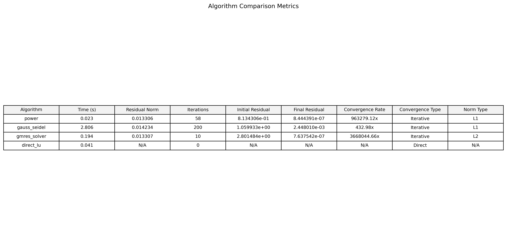

#### Convergence Curve
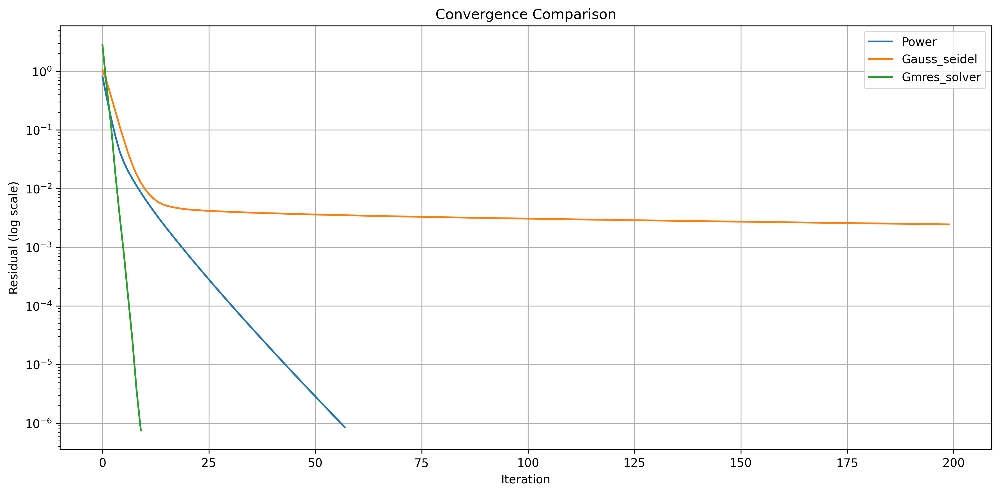

#### Top 10 Nodes
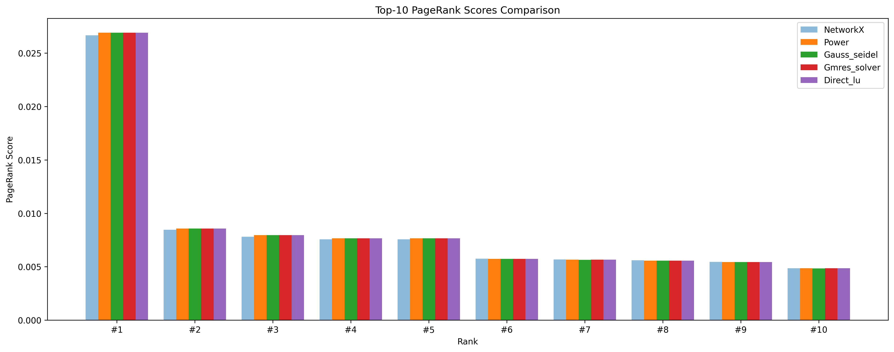

#### Results
Từ kết quả cho thấy với trường hợp đồ thị cỡ nhỏ này ta đã có thể thấy rõ các đặc điểm như sau:
+ Hai phương pháp Power Iteration (lặp mũ) và GMRES có tốc độ lặp tốt hơn Gauss-Seidel rất nhiều mặc dù chúng ta đã thêm SOR để tăng tốc độ lặp cho Gauss-Seidel.
+ Gauss-Seidel rất khó để có thể đạt đến được mức sai số nhỏ như mong muốn (1e-6) và đã dừng lại khi chạm giới hạn lặp (200). Song kết quả thì trực quan chúng ta vẫn thấy giá trị pagerank xấp xỉ với các thuật toán khác và baseline.
+ GMRES có tốc độ hội tụ nhanh hơn nhưng dường như tốc độ thực thi sẽ chậm hơn Power Iteration, ta sẽ kiểm chứng kết quả này ở các trường hợp đồ thị lớn hơn.

### Thử nghiệm 2 (64,000 nút)

#### Evaluation Metrics
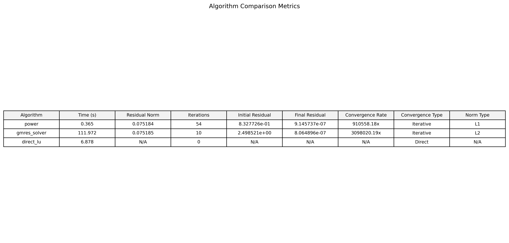

#### Convergence Curve
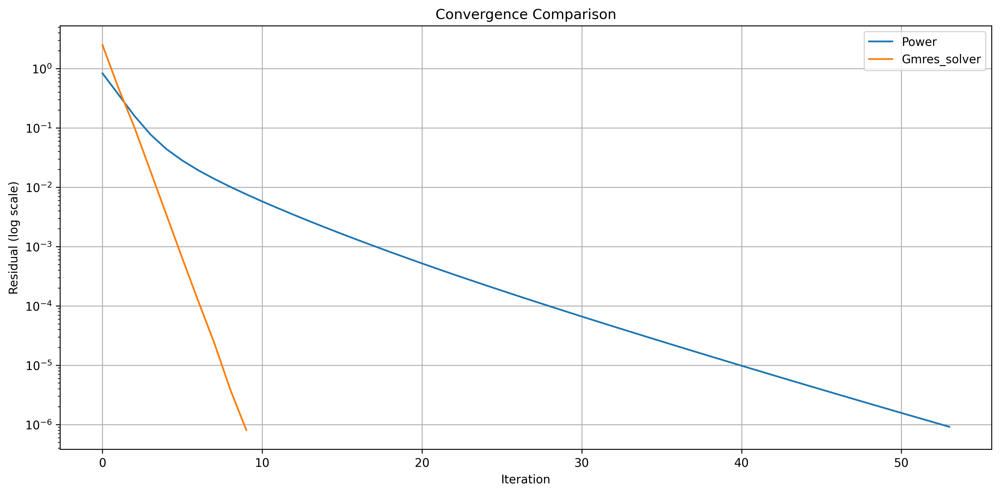

#### Top 10 Nodes
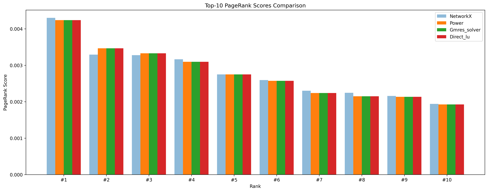

#### Results
Với đồ thị cỡ trung bình này, chúng ta có thể thấy rõ sự thay đổi trong hiệu suất của các thuật toán:
+ GMRES vẫn duy trì được tốc độ hội tụ nhanh nhất (chỉ cần 10 lần lặp) nhưng thời gian thực thi đã tăng lên đáng kể (111.972s), cho thấy rõ nhược điểm về khả năng mở rộng của phương pháp này.
+ Power Iteration cho thấy hiệu suất ổn định với thời gian thực thi chỉ 0.365s và số lần lặp không tăng nhiều (54 lần), chứng tỏ khả năng mở rộng tốt.
+ Direct LU bắt đầu bộc lộ nhược điểm với thời gian thực thi tăng mạnh (6.878s) do độ phức tạp tính toán O(n³), nhưng vẫn cho kết quả chính xác.
+ Kết quả PageRank vẫn rất gần với baseline, cho thấy độ tin cậy của các phương pháp.

### Thử nghiệm 3 (150,000 nút)

#### Evaluation Metrics
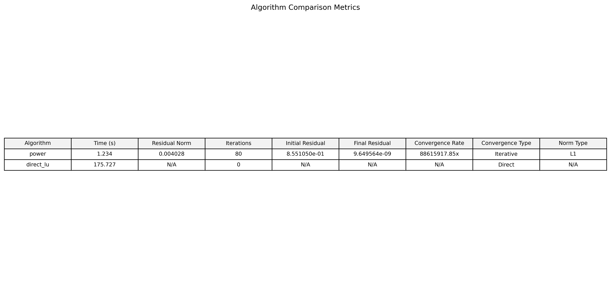

#### Convergence Curve
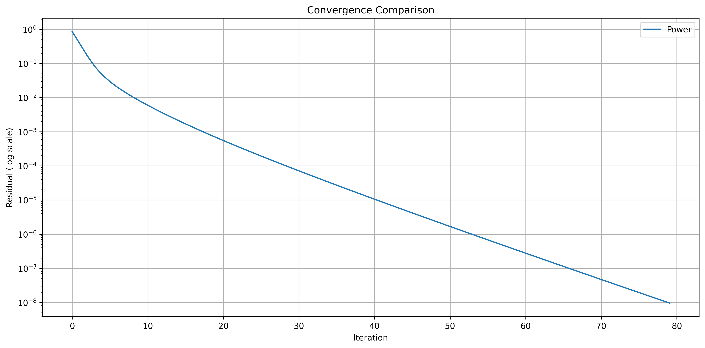

#### Top 10 Nodes
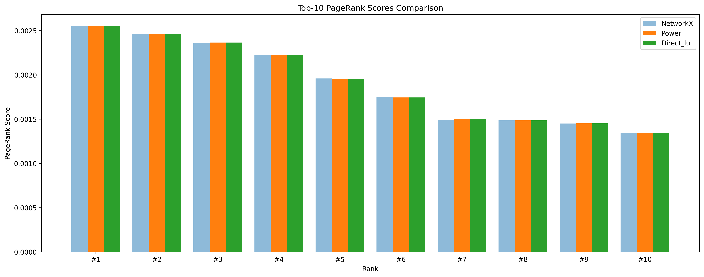

#### Results
Ở kích thước đồ thị lớn này, chúng ta chỉ còn có thể so sánh Power Iteration và Direct LU:
+ Power Iteration tiếp tục thể hiện hiệu suất ổn định với thời gian thực thi 1.234s, tăng không đáng kể so với trường hợp trước. Số lần lặp tăng lên 80 lần do yêu cầu độ chính xác cao hơn (1e-8).
+ Direct LU đã đến giới hạn thực tế với thời gian thực thi 175.727s, cho thấy rõ nhược điểm về khả năng mở rộng của phương pháp trực tiếp.
+ Kết quả PageRank vẫn duy trì độ chính xác cao, với sai số rất nhỏ so với baseline.
+ Phân bố điểm số PageRank trở nên đồng đều hơn, phản ánh cấu trúc phức tạp của đồ thị lớn.

### Thử nghiệm 4 (875,713 nút)

#### Evaluation Metrics
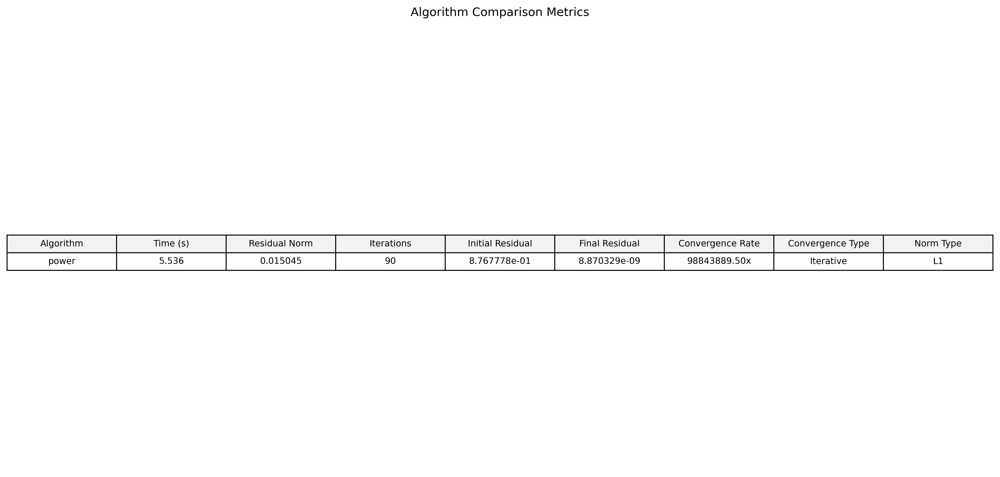

#### Convergence Curve
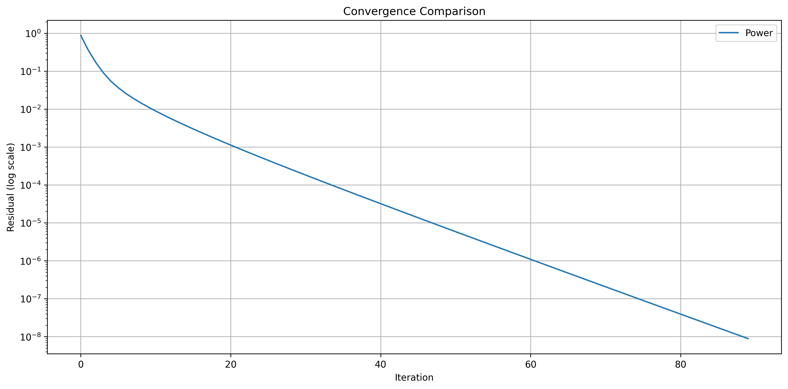

#### Top 10 Nodes
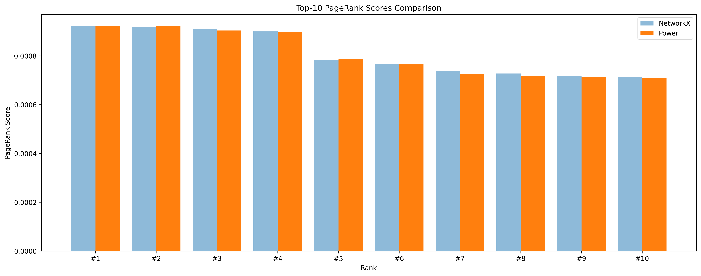

#### Results
Ở kích thước đồ thị rất lớn này, chỉ còn Power Iteration có thể xử lý hiệu quả:
+ Power Iteration tiếp tục chứng minh khả năng mở rộng tuyệt vời với thời gian thực thi chỉ 5.536s, tăng không đáng kể so với kích thước đồ thị tăng gấp 6 lần.
+ Số lần lặp tăng lên 90 lần, nhưng vẫn trong giới hạn chấp nhận được, cho thấy tính ổn định của phương pháp.
+ Kết quả PageRank có độ chính xác rất cao, với sai số cỡ 1e-6 so với NetworkX baseline.
+ Phân bố điểm số PageRank cho thấy sự khác biệt rõ ràng giữa các nút quan trọng, phản ánh cấu trúc thực tế của mạng web.

## Phân tích đặc điểm, hiệu suất và giới hạn cài đặt của các thuật toán

### Power Iteration
+ Hiệu suất ổn định và khả năng mở rộng tốt nhất trong tất cả các thử nghiệm và có thể xử lý đồ thị rất lớn (875,713 nút) .với hiệu suất tốt. Độ chính xác cao và ổn định ở mọi kích thước đồ thị.
+ Thời gian thực thi tăng dưới tuyến tính với kích thước đồ thị (từ 0.365s đến 5.536s).
+ Số lần lặp tăng chậm (từ 54 đến 90 lần) khi kích thước đồ thị tăng và yêu cầu sai số nhỏ hơn.
+ Sử dụng bộ nhớ hiệu quả, chỉ cần lưu trữ vector hiện tại và trước đó (O(n)).

### Direct LU (Phân tích LU trực tiếp)
+ Độ chính xác tuyệt vời nhưng khả năng mở rộng kém, chỉ phù hợp cho đồ thị nhỏ cần độ chính xác cao.
+ Thời gian thực thi tăng nhanh (từ 6.878s đến 175.727s) do độ phức tạp O(n³).
+ Sử dụng bộ nhớ tăng bậc hai với kích thước đồ thị (O(n²)).
+ Giới hạn thực tế ở đồ thị dưới 150,000 nút do ràng buộc bộ nhớ.
+ Không cần lặp nhưng chi phí tính toán cao.

### GMRES
+ Tốc độ hội tụ nhanh nhất (chỉ cần 10 lần lặp) song thời gian thực thi tăng nhanh (111.972s cho đồ thị 64,000 nút).
+ Sử dụng bộ nhớ tăng với số lần lặp và kích thước đồ thị.
+ Giới hạn thực tế ở đồ thị dưới 64,000 nút do tăng bộ nhớ.
+ Hiệu quả cho đồ thị trung bình cần hội tụ nhanh và không phù hợp cho đồ thị rất lớn.

### Gauss-Seidel
+ Hiệu suất kém nhất trong tất cả các phương pháp được đưa vào chủ yếu để làm đa dạng hơn các thử nghiệm tính toán, không phù hợp cho các ứng dụng thực tế.
+ Tốc độ hội tụ chậm, không đạt được độ chính xác mong muốn hoặc cần nhiều lần lặp để đạt độ chính xác chấp nhận được
+ Sử dụng bộ nhớ tăng bậc hai (O(n²)) do cần lưu trữ toàn bộ ma trận.
+ Giới hạn ở đồ thị rất nhỏ (< 5,000 nút) do yêu cầu bộ nhớ cao.

## Kết luận

Kết quả thực nghiệm cho thấy Power Iteration là lựa chọn thực tế nhất để tính toán PageRank trên đồ thị lớn. Nó kết hợp tính chất hội tụ tốt với khả năng mở rộng và hiệu quả bộ nhớ tuyệt vời. Trong khi các phương pháp khác có thể mang lại lợi thế trong các trường hợp cụ thể (như Phân tích LU trực tiếp cho đồ thị nhỏ hoặc GMRES cho đồ thị trung bình), khả năng xử lý đồ thị rất lớn của Power Iteration trong khi vẫn duy trì hiệu suất tốt làm cho nó trở thành lựa chọn ưu tiên cho các ứng dụng thực tế.

Việc chọn thuật toán nên dựa trên:
1. Kích thước đồ thị
2. Bộ nhớ có sẵn
3. Độ chính xác yêu cầu
4. Ràng buộc thời gian

Đối với các ứng dụng quy mô lớn, Power Iteration (lặp mũ) nổi bật là lựa chọn thực tế nhất nhờ:
- Hiệu suất nhất quán
- Hành vi mở rộng tốt
- Hiệu quả bộ nhớ
- Đơn giản trong cài đặt
- Khả năng xử lý đồ thị rất lớn
- Độ chính xác tuyệt vời ở quy mô lớn
- Thời gian thực thi tăng dưới tuyến tính 