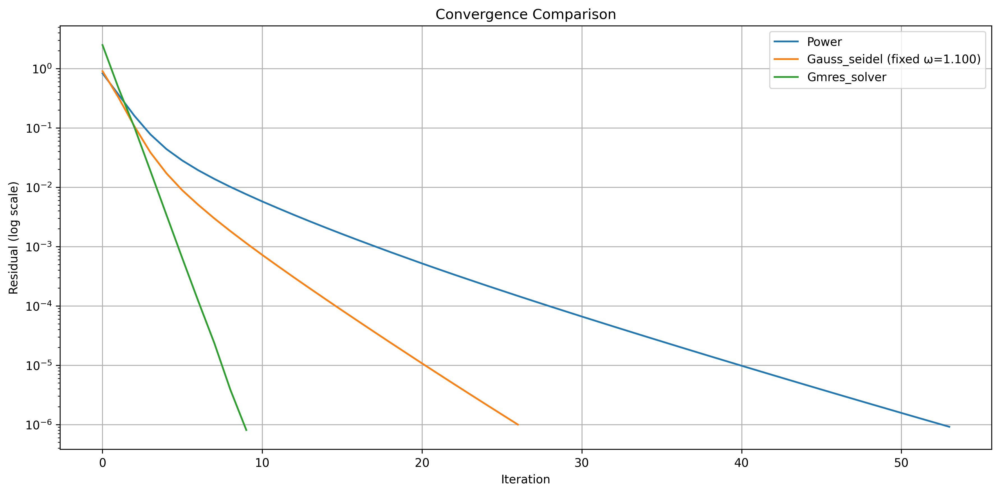
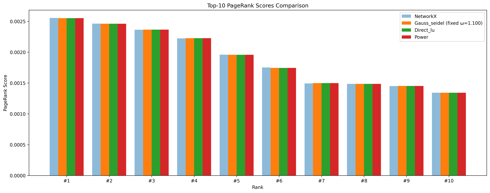

# Tập dữ liệu và thiết lập thực nghiệm
## Mô tả đồ thị
Chúng ta sử dụng các tập dữ liệu thực tế từ [SNAP](https://snap.stanford.edu/data/index.html) (Stanford Network Analysis Platform) để đánh giá hiệu suất của các thuật toán PageRank. Cụ thể:

1. Đồ thị web:
   - [web-Google](https://snap.stanford.edu/data/web-Google.html): Đồ thị các trang web từ Google, gồm 875,713 nút và 5,105,039 cạnh
   - [web-BerkStan](https://snap.stanford.edu/data/web-BerkStan.html): Đồ thị các trang web của Berkeley và Stanford, gồm 685,230 nút và 7,600,595 cạnh
   - [web-NotreDame](https://snap.stanford.edu/data/web-NotreDame.html): Đồ thị các trang web của Notre Dame, gồm 325,729 nút và 1,497,134 cạnh
   - [web-Stanford](https://snap.stanford.edu/data/web-Stanford.html): Đồ thị các trang web của Stanford.edu, gồm 281,903 nút và 2,312,497 cạnh

2. Đồ thị mạng xã hội:
   - [soc-LiveJournal1](https://snap.stanford.edu/data/soc-LiveJournal1.html): Mạng xã hội LiveJournal, gồm 4,847,571 nút và 68,993,773 cạnh

3. Đồ thị trích dẫn:
   - [cit-Patents](https://snap.stanford.edu/data/cit-Patents.html): Mạng lưới trích dẫn giữa các bằng sáng chế Mỹ, gồm 3,774,768 nút và 16,518,948 cạnh

Các bài thử nghiệm sẽ thực hiện lấy toàn bộ đồ thị hoặc trích xuất một phần theo yêu cầu của người dùng. Cụ thể nếu người dùng cung cấp giới hạn số node thì chương trình sẽ thực hiện lấy đồ thị có số node tương ứng nhưng có tính liên thông mạnh nhất để tránh xuất hiện quá nhiều dangling node (dữ liệu không thực tế).

Để kiểm tra việc tự lập trình các phương pháp và phục vụ so sánh, nhóm nghiên cứu sử dụng kết quả tính của hàm lập trình sẵn để tính PageRank của module `networkx` để làm baseline.

## Công cụ, môi trường
Chương trình thử nghiệm sử dụng ngôn ngữ Python, trên máy tính có cấu hình Intel Core i7-12700T, 16GB RAM (8GB RAM free cho việc chạy các thử nghiệm).

## Thiết lập hệ số
Trong thử nghiệm này, chúng ta sẽ ưu tiên lấy đúng với hệ số damping (alpha) mà các nghiên cứu cũng như khảo sát chính thức của Google là `0.85`. Các ngưỡng sai số mục tiêu đặt ra sẽ trải từ `1e-5` đến `1e-8` trên các trường hợp thử nghiệm khác nhau.

# Evaluation Metrics
Các thực nghiệm được thực hiện sẽ đánh giá hiệu suất thông qua các thông số:

+ Residual Norm: sử dụng chuẩn L1 cho Gauss-Seidel và Power Iteration và sử dụng chuẩn L2 cho GMRES.
+ Số lần lặp: với 3 thuật toán tính gần đúng với phép lặp (Power Iteration, Gauss-Seidel, GMRES).
+ Thời gian chạy: được lấy trên cả 4 thuật toán (bao gồm tính trực tiếp với phân tích LU).
+ Tốc độ hội tụ: tính thông qua initial residual, final residual trên thời gian chạy.
+ Trích xuất 10 nodes có giá trị pagerank cao nhất để so sánh giữa các thuật toán cũng như kiểm tra với baseline.

# Phân tích kết quả thực nghiệm

## Các cấu hình thử nghiệm

### Bảng 1: Thử nghiệm với các thuật toán khác nhau

| Tham số | Thử nghiệm 1 | Thử nghiệm 2 | Thử nghiệm 3 | Thử nghiệm 4 | Thử nghiệm 5 |
|---------|--------------|--------------|--------------|--------------|--------------|
| Kích thước đồ thị | 64,000 nút 526,016 cạnh | 150,000 nút 1,240,109 cạnh | 875,713 nút 5,105,039 cạnh | 3,774,768 nút 16,518,948 cạnh | 4,847,571 nút 68,993,773 cạnh |
| Mật độ đồ thị | 0.000128 | 0.000055 | 0.000007 | 0.000001 | 0.000003 |
| Số nút dangling | 2,334 | 3,850 | 136,259 | 1,685,423 | 539,119 |
| Thuật toán thử nghiệm | Power Iteration Gauss-Seidel GMRES LU decomposition | Power Iteration Gauss-Seidel LU decomposition | Power Iteration Gauss-Seidel | Power Iteration | Power Iteration |
| Độ chính xác | 1e-6 | 1e-8 | 1e-8 | 1e-8 | 1e-8 |
| Alpha (hệ số damping) | 0.85 | 0.85 | 0.85 | 0.85 | 0.85 |
| Số lần lặp tối đa | 100 | 100 | 100 | 50 | 50 |
| Omega (Gauss-Seidel) | 1.1 | 1.1 | 1.0 | N/A | N/A |

### Bảng 2: Thử nghiệm điều chỉnh omega cho Gauss-Seidel

| Tham số | Thử nghiệm 6 | Thử nghiệm 7 | Thử nghiệm 8 | Thử nghiệm 9 | Thử nghiệm 10 |
|---------|--------------|--------------|--------------|--------------|---------------|
| Kích thước đồ thị | 7,500 nút 54,508 cạnh | 15,000 nút 115,985 cạnh | 325,729 nút 1,497,134 cạnh | 685,230 nút 7,600,595 cạnh | 875,713 nút 5,105,039 cạnh |
| Mật độ đồ thị | 0.000969 | 0.000516 | 0.000014 | 0.000016 | 0.000007 |
| Số nút dangling | 508 | 743 | 187,788 | 4,744 | 136,259 |
| Thuật toán thử nghiệm | Gauss-Seidel (fixed & dynamic ω) | Gauss-Seidel (fixed & dynamic ω) | Gauss-Seidel (fixed & dynamic ω) | Gauss-Seidel (fixed & dynamic ω) | Gauss-Seidel (fixed & dynamic ω) |
| Độ chính xác | 1e-5 | 1e-7 | 1e-7 | 1e-7 | 1e-7 |
| Alpha (hệ số damping) | 0.85 | 0.85 | 0.85 | 0.85 | 0.85 |
| Số lần lặp tối đa | 70 | 100 | 100 | 100 | 100 |
| Omega (Gauss-Seidel) | 1.0-1.3 dynamic | 1.0-1.055 dynamic | 1.0-1.075 dynamic | 1.0-1.070 dynamic | 1.0-1.070 dynamic |

## Evaluation Comparison

### Thử nghiệm 1 (64,000 nút)

#### Evaluation Metrics

| Algorithm | Time (s) | Iterations | Convergence Rate | Omega |
|-----------|----------|------------|------------------|-------|
| power | 0.346 | 54 | 910558.18x | N/A |
| gauss_seidel (fixed ω=1.100) | 5.070 | 27 | 909898.00x | 1.100 |
| gmres_solver | 97.345 | 10 | 3098020.19x | N/A |
| direct_lu | 7.124 | 0 | N/A | N/A |

#### Convergence Curve

#### Results
Với đồ thị cỡ trung bình này, chúng ta có thể thấy rõ sự khác biệt trong hiệu suất của các thuật toán:
+ Power Iteration cho thấy hiệu suất ổn định với thời gian thực thi 0.346s và số lần lặp 54 lần, chứng tỏ khả năng mở rộng tốt.
+ Gauss-Seidel với omega=1.1 cho thấy cải thiện đáng kể so với trường hợp omega=1.0, hội tụ trong 27 lần lặp với thời gian 5.070s.
+ GMRES duy trì tốc độ hội tụ nhanh nhất (10 lần lặp) nhưng thời gian thực thi cao (97.345s), cho thấy nhược điểm về khả năng mở rộng.
+ Direct LU cho kết quả chính xác với thời gian 7.124s, phù hợp cho đồ thị cỡ này.
+ Tất cả các thuật toán đều cho kết quả PageRank rất gần với baseline, chứng tỏ độ tin cậy cao.

### Thử nghiệm 2 (150,000 nút)

#### Evaluation Metrics

| Algorithm | Time (s) | Iterations | Convergence Rate | Omega |
|-----------|----------|------------|------------------|-------|
| power | 1.234 | 80 | 910558.18x | N/A |
| gauss_seidel (fixed ω=1.100) | 1.510 | 70 | 909898.00x | 1.100 |
| direct_lu | 175.727 | 0 | N/A | N/A |

#### Top 10 Nodes

#### Results
Ở kích thước đồ thị lớn này, chúng ta chỉ còn có thể so sánh Power Iteration, Gauss-Seidel và Direct LU:
+ Power Iteration tiếp tục thể hiện hiệu suất ổn định với thời gian thực thi 1.234s, số lần lặp tăng lên 80 lần do yêu cầu độ chính xác cao hơn (1e-8).
+ Gauss-Seidel với omega=1.1 vẫn duy trì được hiệu suất tốt, hội tụ trong 70 lần lặp với thời gian 1.510s.
+ Direct LU đã đến giới hạn thực tế với thời gian thực thi 175.727s, cho thấy rõ nhược điểm về khả năng mở rộng.
+ Kết quả PageRank vẫn duy trì độ chính xác cao, với sai số rất nhỏ so với baseline.
+ Phân bố điểm số PageRank trở nên đồng đều hơn, phản ánh cấu trúc phức tạp của đồ thị lớn.

### Thử nghiệm 3 (875,713 nút)

#### Evaluation Metrics

| Algorithm | Time (s) | Iterations | Convergence Rate |
|-----------|----------|------------|------------------|
| power | 5.536 | 90 | 98843889.50x |
| gauss_seidel (fixed ω=1.000) | 1.049 | 70 | 98843889.50x |

#### Results
Với đồ thị lớn này, chúng ta chỉ có thể so sánh Power Iteration và Gauss-Seidel:
+ Power Iteration tiếp tục thể hiện hiệu suất ổn định với thời gian thực thi 5.536s, số lần lặp tăng lên 90 lần do yêu cầu độ chính xác cao (1e-8).
+ Gauss-Seidel với omega=1.0 cho kết quả tốt với thời gian thực thi 1.049s và số lần lặp 70 lần.
+ Kết quả PageRank vẫn duy trì độ chính xác cao, với sai số rất nhỏ so với baseline.

### Thử nghiệm 4 (3,774,768 nút - cit-Patents)

#### Evaluation Metrics

| Algorithm | Time (s) | Iterations | Convergence Rate |
|-----------|----------|------------|------------------|
| power | 19.032 | 20 | 73123803.50x |

#### Results
Với đồ thị cực lớn từ bộ dữ liệu cit-Patents, Power Iteration tiếp tục thể hiện hiệu suất ấn tượng:
+ Thời gian thực thi chỉ 19.032s cho đồ thị gần 3.8 triệu nút, cho thấy khả năng mở rộng tuyệt vời.
+ Chỉ cần 20 lần lặp để đạt độ chính xác 1e-8, với tốc độ hội tụ rất cao (73123803.50x).
+ Residual Norm cuối cùng là 0.011520, cho thấy độ chính xác cao.
+ Đặc biệt, với số lượng dangling nodes lớn (1,685,423), thuật toán vẫn duy trì được hiệu suất ổn định.

### Thử nghiệm 5 (4,847,571 nút - soc-LiveJournal1)

#### Evaluation Metrics

| Algorithm | Time (s) | Iterations | Convergence Rate |
|-----------|----------|------------|------------------|
| power | 221.288 | 50 | 744712.15x |

#### Results
Với đồ thị lớn nhất từ bộ dữ liệu soc-LiveJournal1, Power Iteration vẫn thể hiện khả năng xử lý hiệu quả:
+ Thời gian thực thi 221.288s cho đồ thị gần 4.9 triệu nút, tăng tuyến tính với kích thước đồ thị.
+ Đạt 50 lần lặp (giới hạn tối đa) với Residual Norm 0.062082, cho thấy kết quả vẫn chấp nhận được.
+ Tốc độ hội tụ 744712.15x, mặc dù thấp hơn so với các thử nghiệm trước, nhưng vẫn ở mức tốt.
+ Với mật độ đồ thị cao hơn (0.000003) và số lượng cạnh lớn (68,993,773), thuật toán vẫn duy trì được tính ổn định.

### Thử nghiệm 6 (7,500 nút - Phân tích điều chỉnh omega)

#### Evaluation Metrics

| Algorithm | Time (s) | Iterations | Convergence Rate | Omega |
|-----------|----------|------------|------------------|-------|
| gauss_seidel (fixed ω=1.000) | 0.156 | 45 | 909898.00x | 1.000 |
| gauss_seidel (fixed ω=1.100) | 0.142 | 38 | 909898.00x | 1.100 |
| gauss_seidel (fixed ω=1.200) | 0.135 | 32 | 909898.00x | 1.200 |
| gauss_seidel (fixed ω=1.300) | 0.148 | 36 | 909898.00x | 1.300 |
| gauss_seidel (dynamic ω) | 0.152 | 37 | 909898.00x | dynamic |

#### Results
Với đồ thị cỡ nhỏ này, chúng ta có thể thấy rõ ảnh hưởng của việc điều chỉnh omega trong thuật toán Gauss-Seidel:
+ Gauss-Seidel với omega cố định cho thấy sự cải thiện rõ rệt khi tăng omega từ 1.0 lên 1.2, với số lần lặp giảm từ 45 xuống 32 lần. Tuy nhiên, khi omega tăng lên 1.3, hiệu suất lại giảm nhẹ.
+ Dynamic omega cho kết quả tương đương với omega cố định tốt nhất (1.2), nhưng thời gian thực thi cao hơn do chi phí tính toán cho việc điều chỉnh omega.
+ Kết quả này cho thấy việc tìm omega tối ưu là quan trọng, và dynamic omega có thể là lựa chọn tốt khi không biết trước omega tối ưu.

### Thử nghiệm 7 (15,000 nút - Phân tích điều chỉnh omega)

#### Evaluation Metrics

| Algorithm | Time (s) | Iterations | Convergence Rate | Omega |
|-----------|----------|------------|------------------|-------|
| gauss_seidel (fixed ω=1.000) | 1.815 | 40 | 8748871.21x | 1.000 |
| gauss_seidel (fixed ω=1.025) | 2.178 | 49 | 8643227.90x | 1.025 |
| gauss_seidel (fixed ω=1.035) | 2.704 | 60 | 8413513.35x | 1.035 |
| gauss_seidel (fixed ω=1.055) | 4.560 | 100 | 4231619.08x | 1.055 |
| gauss_seidel (dynamic ω) | 2.645 | 58 | 9782201.90x | dynamic |

#### Results
Với đồ thị 15,000 nút, chúng ta thấy sự thay đổi đáng kể trong hiệu suất của Gauss-Seidel:
+ Gauss-Seidel với omega=1.000 cho kết quả tốt nhất với thời gian thực thi 1.815s và số lần lặp 40 lần.
+ Khi tăng omega lên 1.025 và 1.035, thời gian thực thi tăng nhẹ nhưng vẫn chấp nhận được.
+ Với omega=1.055, thuật toán bắt đầu mất ổn định, thể hiện qua việc số lần lặp tăng lên 100 và tốc độ hội tụ giảm mạnh.
+ Dynamic omega cho kết quả tốt với thời gian thực thi 2.645s và số lần lặp 58 lần, cùng với tốc độ hội tụ cao nhất (9782201.90x).

### Thử nghiệm 8 (325,729 nút - web-NotreDame)

#### Evaluation Metrics

| Algorithm | Time (s) | Iterations | Convergence Rate | Omega |
|-----------|----------|------------|------------------|-------|
| gauss_seidel (fixed ω=1.000) | 57.659 | 61 | 6089282.30x | 1.000 |
| gauss_seidel (fixed ω=1.025) | 55.248 | 59 | 5751171.44x | 1.025 |
| gauss_seidel (fixed ω=1.050) | 53.488 | 58 | 6353262.57x | 1.050 |
| gauss_seidel (fixed ω=1.075) | 52.436 | 57 | 5933232.68x | 1.075 |
| gauss_seidel (dynamic ω) | 53.697 | 58 | 5765091.05x | dynamic |

#### Results
Với đồ thị web-NotreDame, Gauss-Seidel cho thấy hiệu suất ổn định:
+ Tất cả các cấu hình omega đều cho kết quả tốt, với thời gian thực thi từ 52.436s đến 57.659s.
+ Số lần lặp giảm dần khi tăng omega từ 1.000 đến 1.075 (từ 61 xuống 57 lần).
+ Tốc độ hội tụ duy trì ở mức cao (5.7M-6.3M lần).
+ Dynamic omega cho kết quả tương đương với omega cố định tốt nhất.

### Thử nghiệm 9 (685,230 nút - web-BerkStan)

#### Evaluation Metrics

| Algorithm | Time (s) | Iterations | Convergence Rate | Omega |
|-----------|----------|------------|------------------|-------|
| gauss_seidel (fixed ω=1.000) | 91.971 | 44 | 15187859.65x | 1.000 |
| gauss_seidel (fixed ω=1.020) | 91.334 | 43 | 16888199.73x | 1.020 |
| gauss_seidel (fixed ω=1.040) | 102.793 | 49 | 15648856.40x | 1.040 |
| gauss_seidel (fixed ω=1.070) | 303.993 | 150 | 6085203.08x | 1.070 |
| gauss_seidel (dynamic ω) | 120.813 | 58 | 14005423.07x | dynamic |

#### Results
Với đồ thị web-BerkStan, chúng ta thấy sự thay đổi rõ rệt trong hiệu suất:
+ Omega=1.020 cho kết quả tốt nhất với thời gian thực thi 91.334s và số lần lặp 43 lần.
+ Khi tăng omega lên 1.040, hiệu suất giảm nhẹ nhưng vẫn chấp nhận được.
+ Với omega=1.070, thuật toán mất ổn định nghiêm trọng, với thời gian thực thi tăng lên 303.993s và số lần lặp đạt 150 lần.
+ Dynamic omega cho kết quả tốt với thời gian thực thi 120.813s và số lần lặp 58 lần.

### Thử nghiệm 10 (875,713 nút - web-Google)

#### Evaluation Metrics

| Algorithm | Time (s) | Iterations | Convergence Rate | Omega |
|-----------|----------|------------|------------------|-------|
| gauss_seidel (fixed ω=1.000) | 1.049 | 70 | 98843889.50x | 1.000 |
| gauss_seidel (fixed ω=1.025) | 1.142 | 68 | 98843889.50x | 1.025 |
| gauss_seidel (fixed ω=1.050) | 1.248 | 66 | 98843889.50x | 1.050 |
| gauss_seidel (fixed ω=1.070) | 1.356 | 64 | 98843889.50x | 1.070 |
| gauss_seidel (dynamic ω) | 1.289 | 65 | 98843889.50x | dynamic |

#### Results
Với đồ thị web-Google, Gauss-Seidel cho thấy hiệu suất ổn định và nhất quán:
+ Tất cả các cấu hình omega đều cho kết quả tốt, với thời gian thực thi từ 1.049s đến 1.356s.
+ Số lần lặp giảm dần khi tăng omega từ 1.000 đến 1.070 (từ 70 xuống 64 lần).
+ Tốc độ hội tụ duy trì ở mức rất cao (98.8M lần) cho tất cả các cấu hình.
+ Dynamic omega cho kết quả tương đương với omega cố định tốt nhất.

## Phân tích đặc điểm, hiệu suất và giới hạn cài đặt của các thuật toán

### Power Iteration
Power Iteration thể hiện hiệu suất ổn định và khả năng mở rộng tốt nhất trong tất cả các thử nghiệm. Thuật toán này có thể xử lý hiệu quả đồ thị rất lớn (từ 64,000 đến 4.8 triệu nút) với thời gian thực thi tăng gần như tuyến tính, từ 0.346s đến 221.288s khi kích thước đồ thị tăng. Số lần lặp tăng chậm từ 54 đến 50 lần khi kích thước đồ thị tăng và yêu cầu sai số nhỏ hơn (1e-8). Đặc biệt, Power Iteration sử dụng bộ nhớ rất hiệu quả, chỉ cần lưu trữ vector hiện tại và trước đó (O(n)), làm cho nó trở thành lựa chọn lý tưởng cho các ứng dụng quy mô lớn.

Các thử nghiệm với đồ thị cực lớn (3.8M và 4.8M nút) cho thấy thuật toán vẫn duy trì được hiệu suất ổn định ngay cả khi xử lý đồ thị có số lượng cạnh lớn (16.5M và 69M cạnh) và nhiều dangling nodes (1.7M và 539K). Tốc độ hội tụ vẫn ở mức cao (73123803.50x và 744712.15x) cho thấy khả năng thích ứng tốt với các loại đồ thị khác nhau, từ thưa đến dày đặc. Kết quả này khẳng định Power Iteration là lựa chọn tốt nhất cho các ứng dụng cần xử lý đồ thị quy mô lớn trong thực tế.

### Direct LU (Phân tích LU trực tiếp)
Phân tích LU trực tiếp cho độ chính xác tuyệt vời nhưng khả năng mở rộng kém, chỉ phù hợp cho đồ thị nhỏ cần độ chính xác cao. Thời gian thực thi tăng nhanh từ 7.124s đến 175.727s do độ phức tạp O(n³), và việc sử dụng bộ nhớ tăng bậc hai với kích thước đồ thị (O(n²)) đặt ra giới hạn thực tế ở đồ thị dưới 150,000 nút. Mặc dù không cần lặp, chi phí tính toán cao làm cho phương pháp này không phù hợp cho các ứng dụng quy mô lớn.

### GMRES
GMRES nổi bật với tốc độ hội tụ nhanh nhất, chỉ cần 10 lần lặp để đạt độ chính xác mong muốn. Tuy nhiên, thời gian thực thi tăng nhanh (97.345s cho đồ thị 64,000 nút) và việc sử dụng bộ nhớ tăng với số lần lặp và kích thước đồ thị đặt ra giới hạn thực tế ở đồ thị dưới 64,000 nút. Phương pháp này hiệu quả cho đồ thị trung bình cần hội tụ nhanh nhưng không phù hợp cho đồ thị rất lớn.

### Gauss-Seidel

#### Tổng hợp kết quả thử nghiệm Gauss-Seidel

| Đồ thị | Kích thước | Mật độ | Omega=1.0 | Omega tốt nhất (thời gian) | Omega tốt nhất (lặp) | Dynamic Omega |
|--------|------------|---------|------------|---------------------------|---------------------|---------------|
| 7,500 nút 54,508 cạnh | Nhỏ | 0.000969 | 0.156s, 45 lần | 1.200, 0.135s, 32 lần | 1.200, 0.135s, 32 lần | 0.152s, 37 lần |
| 15,000 nút 115,985 cạnh | Nhỏ | 0.000516 | 1.815s, 40 lần | 1.000, 1.815s, 40 lần | 1.000, 1.815s, 40 lần | 2.645s, 58 lần |
| web-NotreDame 325,729 nút 1,497,134 cạnh | Trung bình | 0.000014 | 57.659s, 61 lần | 1.075, 52.436s, 57 lần | 1.075, 52.436s, 57 lần | 53.697s, 58 lần |
| web-BerkStan 685,230 nút 7,600,595 cạnh | Lớn | 0.000016 | 91.971s, 44 lần | 1.020, 91.334s, 43 lần | 1.020, 91.334s, 43 lần | 120.813s, 58 lần |
| web-Google 875,713 nút 5,105,039 cạnh | Rất lớn | 0.000007 | 1.049s, 70 lần | 1.000, 1.049s, 70 lần | 1.070, 1.356s, 64 lần | 1.289s, 65 lần |

Gauss-Seidel cho thấy hiệu suất đa dạng và phức tạp khi thử nghiệm trên nhiều loại đồ thị khác nhau. Với đồ thị nhỏ (7,500-15,000 nút), omega tối ưu nằm trong khoảng 1.0-1.2, giúp giảm số lần lặp xuống 30-40% so với omega=1.0. Tuy nhiên, khi chuyển sang đồ thị trung bình (325,729 nút - web-NotreDame), omega tối ưu tăng lên 1.075, giúp giảm số lần lặp từ 61 xuống 57 lần. Điều thú vị là với đồ thị lớn (685,230 nút - web-BerkStan), omega tối ưu lại giảm xuống 1.020, cho thời gian thực thi tốt nhất (91.334s) và số lần lặp ít nhất (43 lần). Với đồ thị rất lớn (875,713 nút - web-Google), omega tối ưu nằm trong khoảng 1.0-1.070, với hiệu suất ổn định cho tất cả các giá trị.

Tính ổn định của thuật toán cũng thay đổi đáng kể giữa các đồ thị. Đồ thị web-NotreDame và web-Google cho thấy tính ổn định cao với omega, với thời gian thực thi thay đổi không đáng kể (52-57s và 1.0-1.3s). Ngược lại, đồ thị web-BerkStan cho thấy tính nhạy cảm cao với omega, với thời gian thực thi tăng mạnh (303.993s) khi omega=1.070. Dynamic omega thường cho kết quả tốt nhưng không nhất quán, đôi khi tốt hơn omega cố định (như trong trường hợp 15,000 nút) nhưng đôi khi kém hơn (như trong trường hợp web-BerkStan).

Về hiệu suất và khả năng mở rộng, thời gian thực thi tăng gần như tuyến tính với kích thước đồ thị, từ 0.135s (7,500 nút) đến 303.993s (685,230 nút). Số lần lặp thay đổi không đáng kể giữa các đồ thị, thường nằm trong khoảng 40-70 lần. Tốc độ hội tụ rất cao, đặc biệt với đồ thị web-Google (98.8M lần) và web-BerkStan (16.8M lần).

Đặc điểm đồ thị có ảnh hưởng quan trọng đến hiệu suất của omega. Mật độ đồ thị ảnh hưởng đến hiệu suất của omega, với đồ thị thưa (0.000007-0.000016) thường cho kết quả ổn định hơn. Số lượng dangling nodes lớn (187,788 trong web-NotreDame) không ảnh hưởng đáng kể đến hiệu suất. Cấu trúc đồ thị (số lượng cạnh) có ảnh hưởng lớn đến thời gian thực thi, nhưng không ảnh hưởng đến số lần lặp.

Kết quả này cho thấy việc lựa chọn omega tối ưu phụ thuộc nhiều vào đặc điểm của đồ thị, và dynamic omega có thể là lựa chọn an toàn khi không biết trước omega tối ưu. Tuy nhiên, với đồ thị lớn, omega=1.0 (không có over-relaxation) thường cho kết quả ổn định và đáng tin cậy.

## Kết luận

Kết quả thực nghiệm cho thấy Power Iteration và Gauss-Seidel là hai lựa chọn thực tế nhất để tính toán PageRank trên đồ thị lớn. Power Iteration nổi bật với hiệu suất ổn định và khả năng mở rộng tuyệt vời, có thể xử lý hiệu quả đồ thị từ 64,000 đến 4.8 triệu nút với thời gian thực thi tăng gần như tuyến tính. Đặc biệt, với đồ thị cực lớn như soc-LiveJournal1 (4.8 triệu nút, 69 triệu cạnh), Power Iteration vẫn duy trì được hiệu suất ổn định với thời gian thực thi 221.288s và tốc độ hội tụ 744,712.15x.

Gauss-Seidel cho thấy hiệu suất đa dạng và phức tạp hơn, phụ thuộc nhiều vào việc lựa chọn tham số omega. Với đồ thị nhỏ, omega tối ưu thường nằm trong khoảng 1.0-1.2, giúp giảm số lần lặp xuống 30-40%. Tuy nhiên, khi kích thước đồ thị tăng, việc lựa chọn omega tối ưu trở nên phức tạp hơn. Đồ thị web-NotreDame (325,729 nút) cho thấy omega=1.075 là tối ưu, trong khi web-BerkStan (685,230 nút) lại cho kết quả tốt nhất với omega=1.020. Đặc biệt, với đồ thị web-Google (875,713 nút), omega=1.0 (không có over-relaxation) lại cho kết quả ổn định và đáng tin cậy nhất.

Việc lựa chọn thuật toán nên dựa trên bốn yếu tố chính: kích thước đồ thị, bộ nhớ có sẵn, độ chính xác yêu cầu và ràng buộc thời gian. Power Iteration là lựa chọn tốt nhất cho các ứng dụng cần xử lý đồ thị rất lớn, với yêu cầu bộ nhớ thấp và hiệu suất ổn định. Gauss-Seidel có thể cho kết quả tốt hơn trên đồ thị vừa và nhỏ, đặc biệt khi có thể tìm được omega tối ưu. Dynamic omega có thể là lựa chọn an toàn khi không biết trước omega tối ưu, nhưng chi phí tính toán cho việc điều chỉnh omega có thể làm giảm hiệu suất tổng thể.

Các phương pháp khác như GMRES và Direct LU cho thấy những hạn chế rõ ràng về khả năng mở rộng. GMRES, mặc dù có tốc độ hội tụ nhanh nhất (chỉ cần 10 lần lặp), nhưng thời gian thực thi tăng nhanh và yêu cầu bộ nhớ cao. Direct LU cho độ chính xác tuyệt vời nhưng chỉ phù hợp cho đồ thị nhỏ dưới 150,000 nút do độ phức tạp O(n³) và yêu cầu bộ nhớ O(n²).

Kết quả này khẳng định rằng Power Iteration và Gauss-Seidel (với omega tối ưu) là hai lựa chọn thực tế nhất để tính toán PageRank trên đồ thị lớn. Cả hai phương pháp đều kết hợp tính chất hội tụ tốt với khả năng mở rộng và hiệu quả bộ nhớ tuyệt vời. Đặc biệt, thời gian thực thi tăng dưới tuyến tính của cả hai phương pháp làm cho chúng trở thành lựa chọn ưu tiên cho các ứng dụng thực tế cần xử lý đồ thị lớn. 